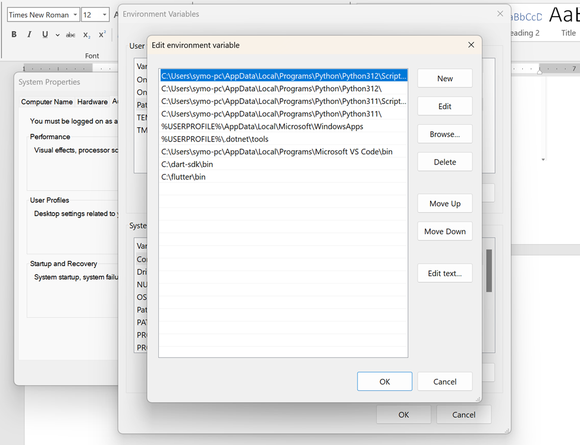
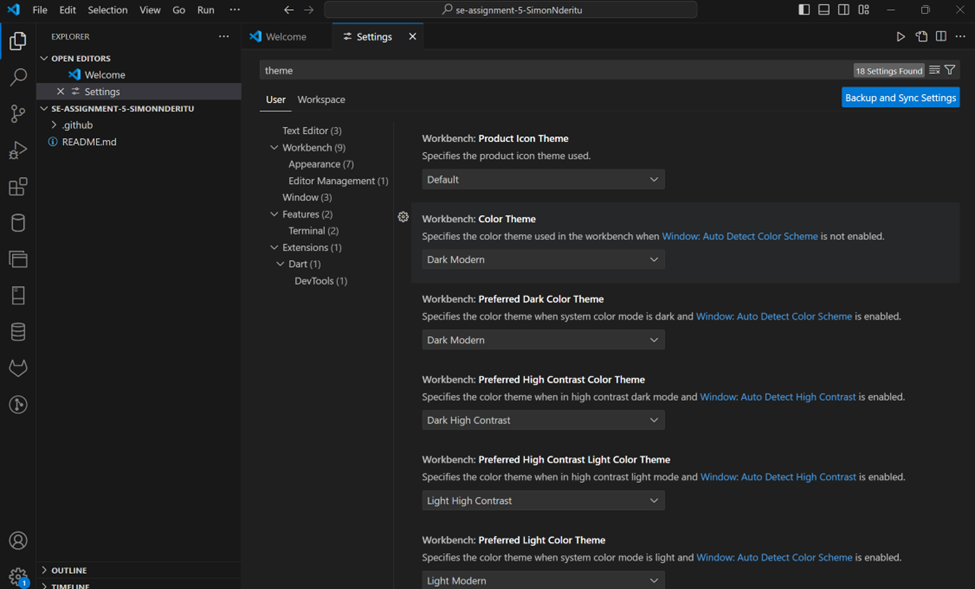

# SE-Assignment-5
Installation and Navigation of Visual Studio Code (VS Code)
 Instructions:
Answer the following questions based on your understanding of the installation and navigation of Visual Studio Code (VS Code). Provide detailed explanations and examples where appropriate.

 Questions:

1. Installation of VS Code:
   - Describe the steps to download and install Visual Studio Code on Windows 11 operating system. Include any prerequisites that might be needed.
   1.	to download visit Visual Studio Code download page and download the version that fits your operating systems architecture for my case(X64) (https://code.visualstudio.com/Download) 

   2.	After downloading, right click and select run as administrator and follow the installation steps as prompted.
   3.	Proceed to environment variables and add path 

   4.	Lauch VS code and install the necessary extensions such as python, SQL, Dart, and flutter

2. First-time Setup:
   - After installing VS Code, what initial configurations and settings should be adjusted for an optimal coding environment? Mention any important settings or extensions.

Initial Configurations and Settings for VS Code can include the following:

General Settings:

Theme: Choose a high-contrast theme to improve readability or choose the theme that is appealing to you.
Auto Save: Enable "Auto Save" to avoid data loss.
File Encoding: Ensure the correct file encoding is set to prevent character issues.
Customize keyboard shortcuts to enhance efficiency.

Language Settings:

Language Modes: Install language-specific extensions to enable syntax highlighting and code completion.
Formatters & Linters: Configure formatters and linters to enforce coding standards and identify errors.

Extensions:

IntelliSense: Enhance code completions and suggestions.
Code Runner: Execute code snippets directly in the IDE.

3. User Interface Overview:
   - Explain the main components of the VS Code user interface. Identify and describe the purpose of the Activity Bar, Side Bar, Editor Group, and Status Bar.

The main components of VS code user interface are

Editor - The main area to edit your files. 

Primary Side Bar - Contains different views like the Explorer to assist you while working on your project.
Status Bar – contains information about the opened project and the files you edit.

Activity Bar - Located on the far left-hand side. 

Panel - An additional space for views below the editor region. 

the above immage was sourced from https://code.visualstudio.com/docs/getstarted/userinterface 

functions of the interface components.

Activity Bar:

Located on the left side of the interface.
The activity bar lets you switch between views and gives you additional context 
Provides quick access to common activities and features, such as: File Explorer, Debugger, Git integration,Terminal

Side Bar:

Side bar provides additional options and tools related to the current activity, such as:
File structure in the File Explorer, Breakpoints in the Debugger, Branches in the Git integration
Editor Group: Takes up the main area of the interface.
Contains open and modified files for editing.
Allows multiple files to be arranged in tabs or split panes.
Provides features for code editing, such as syntax highlighting, auto-completion, and error detection.

Status Bar: 
Located at the bottom of the interface.
Provides information about the current state of the editor, such as:
Line and column number, Indentation information, Git status, Task execution status

4. Command Palette:
   - What is the Command Palette in VS Code, and how can it be accessed? Provide examples of common tasks that can be performed using the Command Palette.

Command Palette in Visual Studio Code (VS Code) is a powerful tool that allows users to quickly execute commands and perform various tasks by typing in keywords. The Command Palette provides access to many commands. You can run editor commands, open files, search for symbols, and see a quick outline of a file, all using the same interactive window.

How to Access the Command Palette:

The command palette is accessed trough combination of the following keys in windows 
Windows: Ctrl + Shift + P

Common Tasks Performed Using the Command Palette:

Ctrl+P enables you to navigate to any file or symbol by typing its name

Ctrl+Tab cycles you through the last set of files opened

Ctrl+Shift+P brings you directly to the editor commands

Ctrl+Shift+O enables you to navigate to a specific symbol in a file

Ctrl+G enables you to navigate to a specific line in a file

5. Extensions in VS Code:
   - Discuss the role of extensions in VS Code. How can users find, install, and manage extensions? Provide examples of essential extensions for web development.

Extensions are software add-ons that enhance the functionality of Visual Studio Code. They allow users to customize their development environment, add new features, and integrate with external services. 

Finding and Installing Extensions

Users can find extensions within VS Code or through the Extension tab.
Navigate to the "Extensions" tab on the left-hand side panel and browse or search for extensions. Once an extension is found, click the "Install" button to add it to VS Code. 

Managing Extensions

After installing extensions, users can manage them through the "Extensions" tab in VS Code where user can:
Disable or enable extensions: Toggle extensions on or off to control their availability.
Update extensions: Keep extensions up-to-date with the latest versions.
Uninstall extensions: Remove extensions from VS Code.
Configure extension settings: Adjust extension settings to customize their behavior.

Essential Extensions for Web Development

These can include the following:
Code Runner: Executes code snippets within the editor.
Prettier: Automatically formats JavaScript, CSS, and HTML code according to coding standards.
ESLint: Lints JavaScript code for errors and stylistic issues.
GitHub Copilot: AI-powered code completion and suggestions.
JSON Tools: Supports editing and validating JSON files.
HTML CSS Support: Autocomplete, linting, and refactoring for HTML and CSS.
VSCode-Icons: Adds icons to file names for easy visual identification

6. Integrated Terminal:
   - Describe how to open and use the integrated terminal in VS Code. What are the advantages of using the integrated terminal compared to an external terminal?

To open the terminal, click the view and select terminal. 
Alternatively, click the three dots as shown in the image bellow and select new terminal or use the combination of the following keys: Ctrl + 

Advantages of Using the Integrated Terminal are numerous , they include:

Convenience: The integrated terminal is built into VS Code, making it accessible within your development environment.

Integration: The terminal seamlessly integrates with VS Code, allowing you to debug from within your code editor and view output in real time.

Customization: You can customize the terminal appearance, settings, and keyboard shortcuts to match your preferences.

Cross-platform support: The integrated terminal is available in VS Code on Windows, macOS, and Linux.
Auto-completion and IntelliSense: The terminal supports auto-completion and IntelliSense for commands and arguments.

Git integration: The terminal provides easy access to Git commands, making it convenient to perform Git operations.

Task management: The terminal can be used to run tasks and monitor their progress, providing a convenient way to manage your development workflow.

7. File and Folder Management:
   - Explain how to create, open, and manage files and folders in VS Code. How can users navigate between different files and directories efficiently?

A user can Create, Open, and Manage Files and Folders in VS Code by:

Creating Files and Folders

Create File: Right-click within the Explorer panel and select "New File".
Create Folder: Right-click within the Explorer panel and select "New Folder".
Opening Files and Folders
Open File: Click on the desired file in the Explorer panel or use the keyboard shortcut (Ctrl + O).
Open Folder: Drag and drop the folder into the VS Code window or use the "Open Folder" icon in the top left corner.
Managing Files and Folders
Rename: Select the file or folder and press F2 or right-click and select "Rename".
Move/Copy: Drag and drop the file or folder within the Explorer panel.
Delete: Select the file or folder and press Delete or right-click and select "Delete".

8. Settings and Preferences:
   - Where can users find and customize settings in VS Code? Provide examples of how to change the theme, font size, and keybindings.

To access settings and preferences, click on the file then click preferences to open settings

Change Theme:

Search for "Theme" in the settings and then Select the desired theme from the list.

To Change Font Size:

Search for "Font Size" in the settings.
Adjust the slider or enter a specific font size in pixels.
Change Keybindings:
Search for "Keybindings" in the settings.
Select the "Default Keyboard Shortcuts" option.
Find the command you want, click on the binding, and press the new key combination.

9. Debugging in VS Code:
   - Outline the steps to set up and start debugging a simple program in VS Code. What are some key debugging features available in VS Code?
Steps to set up and start debugging in VS Code:
   1.	Install the debugger: Ensure the Debugger for Visual Studio Code extension is installed from extensions tab.
   2.	Create a launch configuration: Create a launch configuration file (.vscode/launch.json) that specifies the debugging settings for your program. Configure the type of program (e.g., Node.js, Python), the entry point, and any additional arguments.
   3.	Set breakpoints: Add breakpoints to your code by clicking on the gutter areas next to the lines where you want the debugger to pause execution.
   4.	Start debugging: Open the Debug sidebar (View > Debug), choose the desired launch configuration, and click the "Start Debugging" button.

Key Debugging Features in VS Code:

Breakpoints: Pause execution at specific lines of code.

Watch Expressions: Monitor the values of variables during debugging.

Call Stack: Inspect the sequence of function calls that led to the current execution point.

Variables Viewer: Inspect the values of variables and objects at runtime.

Console Output: View debug messages and program output in the Debug Console.

Step Through: Execute code line by line, stepping into or over function calls.

Resume: Continue program execution from the current breakpoint.

Restart: Restart the debugging session and reload the program.

10. Using Source Control:
    - How can users integrate Git with VS Code for version control? Describe the process of initializing a repository, making commits, and pushing changes to GitHub.
      1. Install Git: Ensure Git is installed on your system. Download it from https://git-scm.com/downloads.
      2. Open VS Code: Launch Visual Studio Code.
      3. Initialize a Repository: Open the project folder you want to version control. In the "Source Control" tab on the left sidebar, click on the "Initialize Repository" button.
      4. Commit Changes: Make your changes to the files in your project. To commit these changes, stage them first. Select the files you want to stage and click on "Stage Changes" in the "Source Control" tab. Once staged, type a commit message and click on "Commit" or "Commit All if you're committing all staged changes.
      5. Push Changes to GitHub: To push your committed changes to GitHub, you need to have a remote repository set up. Click on "Create a Remote Repository on GitHub" in the "Source Control" tab. Follow the prompts to create the repository and push your changes.

 Submission Guidelines:
- Your answers should be well-structured, concise, and to the point.
- Provide screenshots or step-by-step instructions where applicable.
- Cite any references or sources you use in your answers.
- Submit your completed assignment by 1st July 

